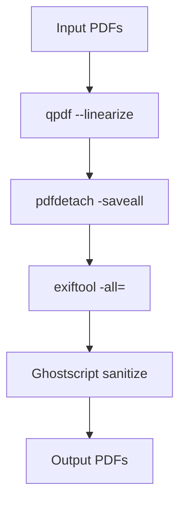

# PDF Sanitization Workflow

This repository provides a Bash script to sanitize PDF files by removing scripts, embedded files, attachments, and metadata, while preserving the original layout and images. The workflow is designed for security and privacy, making it suitable for sharing or archiving sensitive documents.

## Features
- Removes JavaScript and embedded code
- Detaches and deletes embedded files/attachments
- Strips all metadata (author, creation date, etc.)
- Reprocesses PDF to remove hidden content and further sanitize
- Preserves document layout and images

## Requirements
- `qpdf`
- `pdfdetach` (from poppler-utils)
- `exiftool`
- `ghostscript`

Install on Ubuntu/Debian:
```bash
sudo apt-get install qpdf poppler-utils exiftool ghostscript
```

## Usage
## Configuration

All workflow options are controlled via the `sanitize_pdf.conf` file. Example options:

```properties
INPUT_DIR="/path/to/input"           # Directory containing PDFs to sanitize (default: current directory)
OUTPUT_DIR="/path/to/output"         # Directory to save sanitized PDFs (default: current directory)

ATTACHMENT_DIR=""                    # Directory to move extracted attachments (default: none)
#   If set, extracted attachments will be moved here instead of deleted or left in current directory.

RELOCK_CLEANED="no"                  # Relock cleaned PDFs with the original password (yes/no)
#   yes  - Output PDFs will be password protected with the same password used to unlock
#   no   - Output PDFs will NOT be password protected (default)

LOG_FILE="sanitize_pdf.log"           # Name of the log file for actions, errors, and skipped files
#   Example: "sanitize_pdf.log"

FILE_PATTERN="*.pdf"                  # Only process PDFs matching this filename pattern (default: *.pdf)
#   Example: "*_secure.pdf" will only process files ending with _secure.pdf

PASSWORD_TIMEOUT=120                  # Timeout in seconds for password prompt when unlocking PDFs
#   Example: 120 (2 minutes)

DRY_RUN="no"                         # If yes, only show what would be done (no changes made)
#   yes  - Simulate actions, print/log what would happen
#   no   - Perform actual sanitization (default)

OUTPUT_PREFIX="sanitized_"            # Prefix for output files in batch mode
#   Example: "sanitized_" will produce sanitized_original.pdf

MIRROR_DIR_STRUCTURE="no"             # Mirror input directory structure in output (yes/no)
#   yes  - Output files will be placed in subfolders matching input
#   no   - All output files go to OUTPUT_DIR (default)

ENCRYPTION_STRENGTH=256                # Encryption bit strength for relocking PDFs
#   Possible values: 40, 128, 256
#   256 is recommended for strong security (default)

EXIFTOOL_ARGS="-all="                  # Custom arguments for exiftool metadata scrubbing
#   Example: "-all= -XMP:Author= -XMP:Creator="

DELETE_ATTACHMENTS="no"               # Delete extracted attachments after pdfdetach (yes/no)
#   yes  - Delete all files extracted by pdfdetach
#   no   - Keep extracted files (default)

GS_QUALITY="/prepress"                # Ghostscript PDF quality setting
#   Possible values:
#     /screen    - lowest quality, smallest file size
#     /ebook     - medium quality, smaller file size
#     /printer   - high quality, larger file size
#     /prepress  - highest quality, largest file size (default)

CLI_OVERRIDE="no"                     # Allow config options to be overridden by command-line arguments (yes/no)
#   yes  - Command-line arguments take precedence over config
#   no   - Only config file is used (default)
```

If `sanitize_pdf.conf` does not exist, it will be automatically generated with default settings the first time you run the script. You can then edit this file to customize the workflow for your needs. All options are documented in the config file for clarity.

### Single File Mode
```bash
./sanitize_pdf.sh input.pdf output.pdf
```
- `input.pdf`: The original PDF to sanitize
- `output.pdf`: The sanitized output PDF

### Batch Mode
If no arguments are provided, the script will process all PDF files in the input directory (`INPUT_DIR`, default is current directory):
```bash
./sanitize_pdf.sh
```
All sanitized files will be saved to the output directory (`OUTPUT_DIR`, default is current directory) with the prefix `sanitized_`.

## Workflow Diagram



### Flowchart Notes
A: [Input PDF(s)]

B: ["qpdf --linearize: Removes JavaScript and embedded code"]

C: ["pdfdetach -saveall: Removes attachments and embedded files"]

D: ["exiftool -all=: Removes all metadata"]

E: ["Ghostscript: Removes hidden content, further sanitizes, preserves layout and images"]

F: [Output PDF(s)]

## Tool Explanations & Context
## Additional Features

- **Password-Protected PDFs**: If a PDF is encrypted, the script will prompt for a password. The timeout for entry is configurable (`PASSWORD_TIMEOUT`). If no password is entered in time, the file is skipped and a note is added to the log file.
- **Batch Processing**: Supports processing all PDFs in a folder at once if no arguments are given. Output file prefix is configurable (`OUTPUT_PREFIX`).
- **Logging**: All major actions, password prompts, and skipped files are logged with timestamps to the log file (`LOG_FILE`).
- **Relock Option**: You can choose to relock cleaned PDFs with the original password (`RELOCK_CLEANED`).
- **Encryption Strength**: Set the bit strength for relocking (`ENCRYPTION_STRENGTH`).
- **Attachment Deletion**: Optionally delete extracted attachments after sanitization (`DELETE_ATTACHMENTS`).
- **Ghostscript Quality**: Control output PDF quality and size (`GS_QUALITY`).

This workflow uses several command-line tools, each reinforcing the overall sanitization process:

- **qpdf**: Used with `--linearize --sanitize` to remove JavaScript, embedded code, and optimize the PDF structure. This is the first layer of defense against potentially malicious content.

- **pdfdetach**: Extracts and removes all embedded files and attachments from the PDF. This step ensures that no hidden files remain, which could otherwise bypass sanitization.

- **exiftool**: Strips all metadata (author, creation date, etc.) from the PDF. Removing metadata protects privacy and prevents leakage of sensitive information.

- **Ghostscript**: Reprocesses the PDF to remove hidden content and further sanitize the file, while preserving the document layout and images. This final step ensures the output is clean and visually unchanged.

### Context Reinforcement
Each tool addresses a specific aspect of PDF sanitization. While some features may seem redundant, their combined use ensures comprehensive coverage:

- If one tool misses a type of embedded content, the next tool can catch it.
- The workflow is designed to layer protections, so context from previous steps strengthens the effectiveness of subsequent tools.

This multi-tool approach is essential for robust PDF sanitization, especially when handling sensitive or potentially risky documents.

## How It Works
1. **Sanitize PDF**: `qpdf` removes scripts, JavaScript, and embedded code.
2. **Remove Attachments**: `pdfdetach` extracts and deletes embedded files/attachments.
3. **Strip Metadata**: `exiftool` deletes all metadata from the PDF.
4. **Reprocess PDF**: `Ghostscript` further sanitizes and preserves layout/images.

## License
MIT

## Contributing
Pull requests are welcome. For major changes, please open an issue first to discuss what you would like to change.

## Disclaimer
This script is provided as-is. Always verify the output for your specific use case and compliance requirements.
